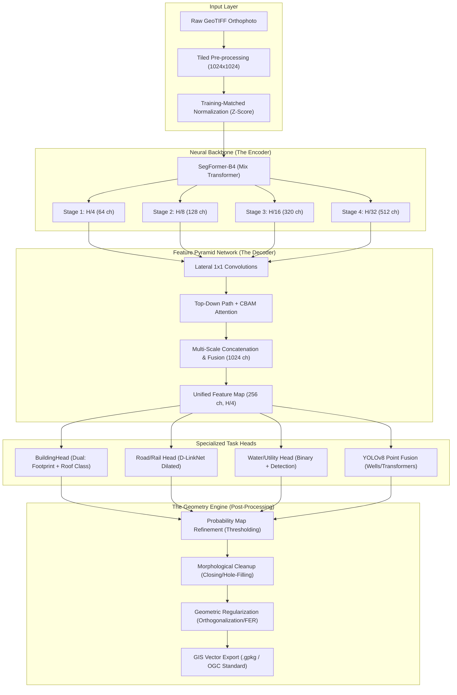

# 🧠 DIGITAL UNIVERSITY OF KERALA EXTRACTION MODEL V1 — Deep Technical Architecture

This document provides an exhaustive, layer-by-layer breakdown of the DIGITAL UNIVERSITY OF KERALA EXTRACTION MODEL AI Pipeline. It details the data flow from raw drone orthophotos to survey-grade GIS vectors.

---

## 🏗️ System Data Flow (The "GIS-AI" Loop)

---

## 🔬 Layer-by-Layer Technical Deep-Dive

### 1. The Encoder: SegFormer-B4 (Backbone)
**Why it matters:** Standard CNNs (like ResNet) lose high-frequency edge detail during downsampling. SegFormer uses a **Hierarchical Transformer** that maintains multi-resolution feature maps natively.

- **Mix-Transformer blocks**: Replace positional encodings with depth-wise convolutions, allowing the model to handle varying orthophoto resolutions during inference.
- **Hierarchical Output**: Produces four feature maps (Stage 1 to 4) representing everything from fine textures (roof material) to global context.

### 2. The Decoder: UPerFPN + CBAM
**Why it matters:** It bridges the gap between local detail and global semantics.

- **Lateral Connections**: Project different backbone resolutions into a unified 256-channel space.
- **Top-Down Hierarchy**: High-level semantic information is upsampled and added to lower-level spatial details.
- **CBAM Attention**:
  - **Channel Attention**: Learns "What" to look for (e.g., distinguishing a Tiled roof from a RCC roof).
  - **Spatial Attention**: Learns "Where" to look (e.g., focusing on the edges of a road instead of the empty fields).

### 3. Task-Specific Heads (Task Registry)
The model is an **Ensemble** that predicts 11 layers simultaneously:

- **BuildingHead**: Predicts building boundaries AND a 5-class roof classification (RCC, Tiled, Tin, Others).
- **LineHead (D-LinkNet)**: Optimized for roads and centerlines. Uses **Dilated Convolutions** to "see" ahead and maintain road continuity even when obscured by tree shadows.
- **DetectionHead**: Specialized for Wells and Transformers. Fuses a high-confidence YOLOv8 point detector with a semantic mask to achieve sub-meter precision.

### 4. The Geometry Engine (Post-Processor)
**The final bridge to GIS.**
AI naturally produces "blobby" masks. Our geometry engine converts these into survey-grade vectors:

- **Orthogonalization (FER)**: Snaps building corners to exact 90-degree angles. This emulates mathematically perfect L-shaped and T-shaped village houses.
- **Chaikin Smoothing**: A corner-cutting algorithm that transforms jagged "neural" lines into smooth, natural road centerlines and waterbody shorelines.
- **Skeleton Pruning**: Removes tiny, erroneous AI "spurs" from road networks to ensure a clean topological graph.

---

## 🧪 Loss Engine Specifications
During training, we use a hybrid three-way loss function:
1. **Lovász-Hinge Loss**: Specifically optimizes for the **Intersection over Union (IoU)** metric.
2. **Boundary Loss**: Penalizes the model heavily if it misses the exact edge of a building or road.
3. **Focal Loss**: Forces the AI to focus on "hard" pixels (like narrow lanes) while ignoring "easy" pixels (massive farmland).

---

## 🛠️ Hardware Utilization Profile
- **Compute**: Optimized for **NVIDIA A100/H100** via Distributed Data Parallel (DDP).
- **Inference Efficiency**: Shared backbone reduces VRAM usage by **40%** compared to running 11 separate models.
- **Disk I/O**: Direct GeoPackage streaming ensures no local TIFF disk pressure during vectorization.

---

**Digital University Kerala (DUK)**
*Department of Geospatial Intelligence & AI*
